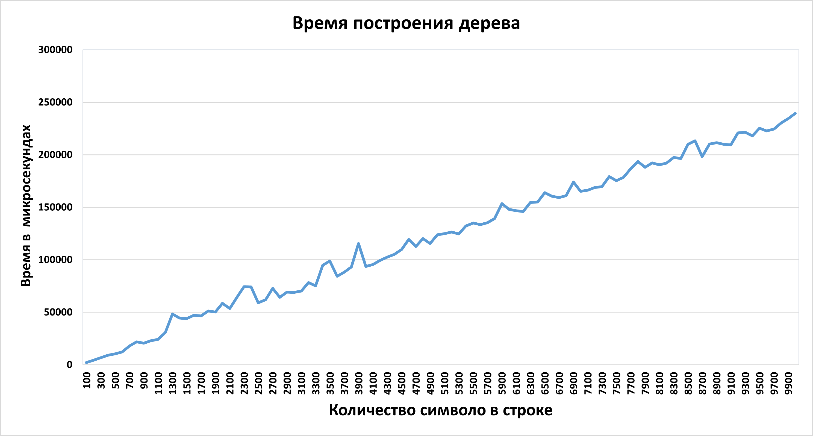

## Федеральное агентство по образованию РФ
## Дальневосточный федеральный университет
## ИНСТИТУТ МАТЕМАТИКИ И КОМПЬЮТЕРНЫХ ТЕХНОЛОГИЙ
## Департамент математического и компьютерного моделирования
# Алгоритм - Построение суффисного дерева алгоритмом Укконена.
## Доклад
### Студента гр. Б9121-09.03.03пикд
### Рыжков Данил Максимович.
### Руководитель
### Кленин А. С.
### г. Владивосток 2023

----------------------------------------------------------
# Содержание
- <a href = "#G">Глоссарий</a>
- <a href = "#V">Введение</a>
     - <a href = "#Z">Задача Online поиск шаблонов в тексте</a>
     - <a href = "M">Основная идея алгоритма заключается в нескольких модификациях</a>
     - <a href = "#K">Как же предобработать текст?</a>
- <a href = "#B">Основополагающая идея: построить суффиксное дерево(бор на суффиксах)</a>
- <a href = "#S">Сжатое Суффиксное дерево</a>
- <a href = "#P">Построение сжатого суффиксного дерева</a>
    - <a href = "#A">Алгоритм</a>
    - <a href = "#CHAR">Операция добавления символа</a>
- <a href = "#Pol">Положения</a>
  - <a href = "#First">Первый тип</a>
  - <a href = "#Second">Второй тип</a>
  - <a href = "#Thirty">Третий тип</a>
  - <a href = "#Change">Изменение типов</a>
- <a href = "#Perexod">Переход от положения к положению:Суффиксная ссылка</a>
  - <a href = "#SuffLink">Как создавать суффиксные ссылки?</a>
  - <a href = "#R">Рассмотрим применение суффиксных ссылок</a>
- <a href = "#Struct">Структура дерева</a>
- <a href = "#time">Итоговая оценка времени работы</a>
- <a href = "#test">Тестирование</a>
- <a href = "#Real">Реалицазия</a>
    - <a href = "#Node">Конструктор Узла</a>
    - <a href = "#D">Деструктор</a>
    - <a href = "#F">Функция построения дерева</a>
    - <a href = "#Ras">Расширение суффиксного дерева</a>
- <a href = "#List">Список литературы</a>

------------------------------------------------
## Глоссарий <p id = "G"></p>
- __`Строка (text)`__ – это последовательность символов, взятых из заранее определенного алфавита. Каждый символ строки имеет определлённый номер - индекс, в порядке от 0 до N, где N - длина строки.
- __`Подстрока`__ – это часть строки, состоящая из некоторого количества смежных символов исходной строки. Например "bc" - подстрока  строки  "abcd".
- __`Префикс`__ - это подстрока строки __S__  заканчивающеяся в позиции __i__, т.е это подстрока __S[1..i]__.
- __`Суффикс`__ - это подстрока строки __S__, начинающеяся в позиции __i__ и заканчивающеяся в __m__ - где __m__ это длина строки __S__. Представляется как __S[i..m]__.
Например суффиксы строки __"abcab"__ представлены ниже в таблице.
 
    | Индекс |Суффикс|
    | ------ |-----:|
    |    0   | abcab |
    |    1   | bcab |
    |    2   | cab |
    |    3   | ab |
    |    4   | b |
    |    5   | ""|

- __`Суффиксное дерево(бор на суффиксах`__ - дерево, содержащие все суффиксы некоторой строки (и только их).
                                                  Позволяет выяснять, является ли  строка w  подстрокой  исходной строки t, за время О (|w|), где |w| — длина подстроки w.
- **`Сжатое суффиксное дерево`** - это некоторая оптимизация несжатого дерева, в котором структуру из нескольких
                                         последовательных вершин, выглядящих как односвязный список, заменяют на одно ребро, хранящее в себе подстроку из символов всех сжатых вершин.
- **`Конкатенация`** — операция склеивания объектов линейной структуры, обычно строк. 
                             Например, конкатенация слов «микро» и «мир» даст слово «микромир».
- **`Суффиксная ссылка`** - Пусть __xα__ обозначает произвольную строку, где __x__ — её первый символ,
                                а __α__ — оставшаяся подстрока (возможно пустая).
                                Если для внутренней вершины __v__ с хранящимся внутри  __xα__ существует другая вершина __s(v)__ с хранящимся внутри __α__,
                                то ссылка из __v__ в __s(v)__ называется суффиксной ссылкой.
- __`Итерация`__ — способ организации обработки данных, при котором определенные действия повторяются многократно,
                    не приводя при этом к рекурсивным вызовам программ. 


----------------------------------------
## Введение <p id = "V"></p>
***Алгоритм Укконена*** — это онлайн-алгоритм построения суффиксного дерева за линейным время,
 который изобрел Эско Укконен в 1995 году.

Алгоритм, который изобрел Эско Укконен для построения суффиксного дерева за линейное время можно представить сначала как простой,
 но неэффективный метод, который с помощью нескольких приёмов достигает уровня лучших алгоритмов по времени счёта в наихудших условиях. [[2]](https://neerc.ifmo.ru/wiki/index.php?title=Алгоритм_Укконена)

Позже были изобретены другие, более эффективные алгоритмы, например обновленный алгоритм Питера Вайнера.

Понять как  работает алгоритм поможет постановка задачи.

--------------------------------------

### Задача Online поиск шаблонов в тексте <p id = "Z"></p>
Дана некоторая строка __T__, которую можно прочитать и предобработать. Дан ряд подстрок исходной строки __T__.

 Требуется за длину подстроки  __***O***(|P|)__ сказать,
 находиться ли он в тексте, и если да, то на какой позиции. При этом мы не хотим просматривать заново текст.  [[17]](https://compscicenter.ru/courses/algorithms-2/nsk/2018-spring/classes/3764/)

---------------------------
### Основная идея алгоритма заключается в нескольких модификациях бора <p id = "M"></p>
- Использование Сжатого суффиксного дерева.
- Хранение подстрок не полностью, а лишь  индексы начала и конца подстроки относительно исходной строки.
- Использованние суффиксных ссылок.[[3]](https://habr.com/ru/post/111675/)
----------------------------------

### Предобработка строки <p id = "K"></p>
Для начала стоит понять, что подстрока - это префикс суффикса.
Например имеется строка - **"abcaf"**,  подстрока "ca" является префиксом **"ca"** суффикса **"caf"**.

Отсюда вытекает идея каким то образом закодировать все суффиксы текста,
чтобы быстро можно было проверить подстроку, является ли она перфиксом какого-либо суффикса текста.


Число суффиксов текста равно длине самого текста, это следует из определения суффикса. 

--------------------------------------------

### Основополагающая идея: построить суффиксное дерево(бор на суффиксах) <p id = "B"></p>

<center> 


<div>Рис.1</div>
</center> 


Размер у такой структуры слишком большой, чтоб быстро отвечать на запрос поиска подстроки.
Возникает вопрос, как уменьшить данную структуру?

Перестроем суффиксное дерево в сжатое суффиксное дерево. Для начала все внутреннии вершины у которых один ребёнок уберём
 и поместим на одну дугу символы, которые в них хранились. Теперь на ребрах хранятся подстроки исходного текста.
Для уменьшения по затратам памяти, хранить их будем в виде **[start...end]**,
 где **start** - начало подстроки в тексте, **end** - конец подстроки в тексте. [[17]](https://compscicenter.ru/courses/algorithms-2/nsk/2018-spring/classes/3764/)

<center> 


<div>Рис.2</div>
</center> 

Линейный ли размер у данной структуры? Заметим, что листьев может быть не больше чем суффиксов,
 то есть ***O(|T|)***. Следовательно внутренних вершин не более чем ***O(|T| - 1)***, а так как подстроки мы храним в виде пары индексов
 значит размер данной структуры линейный.


------------------------

### Сжатое Суффиксное дерево <p id = "S"></p>  
- ` Сжатое Суффиксное дерево для m-символьной строки S` — это ориентированное дерево с корнем,
 имеющее ровно m листьев, занумерованных от 1 до m. Каждая внутренняя вершина, отличная от корня,
 имеет не меньше двух детей, а каждая дуга помечена непустой подстрокой строки S (дуговой меткой).
 Никакие две дуги, выходящие из одной и той же вершины, не могут иметь пометок, начинающихся с одного
 и того же символа. Главная особенность суффиксного дерева заключается в том,
 что для каждого листа конкатенация меток дуг на пути от корня к листу i в точности составляет (произносит) суффикс строки S,
 который начинается в позиции i. То есть этот путь произносит S[i..m]. 

Но определение суффиксного дерева для S не гарантирует, что такое дерево действительно существует для любой строки S.
 Трудность состоит в том, что если один суффикс совпадает с префиксом другого суффикса,
 то построить суффиксное дерево, удовлетворяющее данному выше определению, невозможно,
 поскольку путь для первого суффикса не сможет закончиться в листе.


Например, если удалить последний символ из строки ‘xabxac’, образовав строку ‘xabxa’,
 то суффикс ‘ха’ будет префиксом суффикса ‘xabxa’, так что путь, произносящий ‘ха’,
 не будет заканчиваться в листе.
Во избежание этой трудности предполагается, что последний символ строки S нигде больше в строку не входит.


При таком условии никакой суффикс строки не сможет быть префиксом другого суффикса. Чтобы обеспечить это на практике,
 можно добавить в конце строки S какой-либо символ, не входящий в основной алфавит. Чаще всего используется символ ‘$’. [[26]](https://neerc.ifmo.ru/wiki/index.php?title=Суффиксный_бор)

----------------------------------------------
## Построение сжатого суффиксного дерева <p id = "P"></p>

Для начала рассмотрим положения в дереве:
<center> 


<div>Рис.3</div>
</center> 

Можно заметить, что положения суффиксов бывают неявными, чтобы это исправить построим дерево для
 конкатенации исходной строки и терминального символа **$$S +"TERMINATION_SYMBOL"$$**.
В качестве которого должен быть символ не встречающийся в строке, обычно используют **"$"**.
Но так же можно использовать символ конца строки **"/0"**.

Тогда дерево принимает вид:
<center> 


<div>Рис.4</div>
</center> 

------------------------------------

### Алгоритм <p id = "A"></p>
- Начинаем с пустого дерева.
- На каждом шаге добавляем очередной символ строки.
- На i-ом шаге удлинняются i  суффиксов

<center> 


<div>Рис.5</div>
</center> 

Итераций - в простонародье шагов, будет линейное количество - длина строки.

-----------------------------------------

### Операция добавления символа <p id = "CHAR"></p>
- Требуется добавить символ **"a"** к **i** суффиксам.
- На **i**-ой итерации символ нужно добавить в **i** положений в дереве.
- Перебираем эти  положения в порядке уменьшения глубины.

Переход между положениями осуществляется с помощью суффиксных ссылок и будет рассмотрен в дальнейшем.
<center> 


<div>Рис.6</div>
</center> 

Для удобства ребра будут называться дугами.

Рассмотрим три случая вставки нового символа:
1. Мы находимся в листе, в таком случае продлеваем лист.
2. Положение без символа **"a"** в начале исходящих дуг, в таком случае эти положения нужно преобразовать, добавим новые дуги. Неявные положения станут явными, а к явным добавиться новый лист.
3. Положение с символом **"a"** в начале исходящих дуг,в таком случае ничего не добавляем.[[17]](https://compscicenter.ru/courses/algorithms-2/nsk/2018-spring/classes/3764/)

---------------------------------------
## Положения <p id = "Pol"></p> 
### Первый тип <p id = "First"></p>

<center> 


<div>Рис.7</div>
</center> 

При добавлении символа в лист, нам достаточно расширить дугу которая в этой лист идёт,
 а так как это лист то в нем заканчивается один из суффиксов текущей части строки т.е __i__,
 соответсвенно при расширении **i** увеличивается на 1.

Заметим,что первый тип всегда преобразуется в самого себя т.е на каждой итерации мы удлинеям существующие листы.
Чтобы ускорить данную операцию, можно воспользоваться указателями.

Пусть переменная ***end** будет указателем.Так же создадим глобальную переменную **LeafEnd** и будем увеличчиввать её на 1 каждом шаге.
Тогда если при создании листов на дуге будет сохранена __*end = &leafEnd__ это позволит расшиирять дугу неявным образом.
 Так как __&__ обращается к адресу в памяти, а __\*__ преобразует его в хранящееся по этому адресу число.

Таким образом листья можно не трогать.

-----------------------------------------
### Второй тип <p id = "Second"></p>

При втором типе, мы так или иначе добавляем новую вершину, а так как вершин у  линейное количество,
 это даёт надежду на построение алгоритма за линейное время.

------------------------------------------

### Третий тип <p id = "Thirty"></p>

Изменять дерево не требуется. Продвигаемся вперед по строке.

Т.к мы перебираем положения в порядке уменьшения глубины то заметим, что номера типов положений не убывают:**« 1,..., 1, 2,...,2, 3,..., 3 »**.
Значит как только встретили положение типа 3, можем переходить к следующей итерации.

Почему это так?

<center> 


<div>Рис.8</div>
</center> 

Раз мы перебираем положения от более глубоких к менее глубоким, то при переходе мы попадаем в суффикс короче на один символ.
Исходя из этого утверждается, что если у дуги **aβ**, есть продолжение то у дуги **β** оно тоже есть.
Т.е если  **aβ** не явлется листом, то **β** тоже не является листом.

--------------------------------------

### Изменение типов <p id = "Change"></p>

<center> 


<div>Рис.9</div>
</center> 

Как было подмеченно ранее, положения типа 1 и 2 изменяются в положения типа 1, а вот положение типа 3, может привести нас к любому типу.
Положений типа 2 у нас линейное количество,но положений типа один может встретиться неопределенное количество.

Поэтому докажем,что суммарно всех положений которые нам предстоит пройти будет линейное количество от длины строки.
Для этого введем понятие **Потенциал**, которое определяется как символьнаая глубина,она же в свою очередь означает самое глубокое положение на итерации.
- Таким образом образом потенциал будет уменьшаться на 1 при переходе в следующему положению в итерации, поскольку глубина положения изменится на 1.
- Увеличиваться же потенциал будет на 1 при переходе на следующую итерацию, поскольку глубина в таком случае увеличивается на 1 символ.
- Следовательно мы посетим линейное количетво положений.

----------------------------------------------------


## Переход от положения к положению:Суффиксная ссылка <p id = "Perexod"></p>

Также нам понадобится понятие суффиксной ссылки. Она определена для внутренних вершин дерева. 
Переход по суффиксной ссылке будет вести в вершину, соответствующую той же строке, но без первого символа.
Для корня суффиксная ссылка не определена.

-----------------------------------------------
### `Лемма`

Для любой внутренней вершины v суффиксного дерева существует суффиксная ссылка,
 ведущая в некоторую внутреннюю вершину u.

** **
-------------------------------------------------
### `Доказательство`

Рассмотрим внутреннюю вершину v с путевой меткой **s[start…i]**. Так как эта вершина внутренняя,
 её путевая метка ветвится справа в исходной строке.
 Тогда очевидно подстрока **s[start+1…i]** тоже ветвится справа в исхдной строке,
 и ей соответствует некоторая внутренняя вершина **u**.
 По определению суффиксная ссылка вершины **v** ведёт в **u**.

** **
------------------------------------------

### Создание суффиксных ссылок <p id = "SuffLink"></p>

Для вершин положение которых типа 1, суффиксная ссылка не изменяется.

Для положения типа 2, поскольку образуется новая вершина, мы запоминаем существующую суффиксную ссылку,
 чтобы в дальнейшем испльзуя её создать у новой вершины суффиксную ссылку.
И когда на **i**-ой итерации создаётся новая(не первая) вершина для этой итерации, то она сойденяется с созданной до этого вершиной суффиксной ссылкой.

Легко увидеть, что в процессе построения суффиксного дерева уже построенные суффиксные ссылки никак не изменяются.
 Поэтому осталось сказать, как построить суффиксные ссылки для созданных вершин.
 Рассмотрим новую внутреннюю вершину **v**, которая была создана в результате продления суффикса **S[start…i−1]**.
 Вместо того, чтобы искать, куда должна указывать суффиксная ссылка вершины **v**, поднимаясь от корня дерева для этого,
 перейдем к продлению следующего суффикса **S[start+1…i−1]**. И в этот момент можно проставить суффиксную ссылку для вершины **v**.
 Она будет указывать либо на существующую вершину, если следующий суффикс закончился в ней, либо на новую созданную.
 То есть суффиксные ссылки будут обновляться с запаздыванием. Внимательно посмотрев на все три правила продления суффиксов,
 можно осознать, что для вершины v точно найдётся на следующей фазе внутренняя вершина, в которую должна вести суффиксная ссылка.

<center> 


<div>Рис.10</div>
 </center>


### Рассмотрим применение суффиксных ссылок <p id = "R"></p>

 Пусть только что был продлён суффикс **S[start…i−1]** до суффикса **S[start…i]**.
 Теперь с помощью построенных ссылок можно найти конец суффикса **S[start+1…i−1]** в суффиксном дереве,
 чтобы продлить его до суффикса **S[start+1…i]**. Для этого надо пройти вверх по дереву до ближайшей внутренней вершины **v**,
 в которую ведёт путь, помеченный **S[start…r]**. У вершины **v** точно есть суффиксная ссылка (о том, как строятся суффиксные ссылки,
 будет сказано позже, а пока можно просто поверить). Эта суффиксная ссылка ведёт в вершину **u**, которой соответствует путь,
 помеченный подстрокой **S[start+1…r]**. Теперь от вершины **u** следует пройти вниз по дереву к концу суффикса **S[start+1…i−1]**
 и продлить его до суффикса **S[start+1…i]**.

Подстрока **S[start+1…i−1]** является суффиксом подстроки **S[start…i−1]**, следовательно после перехода по суффиксной ссылке в вершину,
 помеченную путевой меткой **S[start+1…r]**, можно дойти до места, которому соответствует метка **S[r+1…i−1]**,
 сравнивая не символы на рёбрах, а лишь длину ребра по первому символу рассматриваемой части подстроки и длину самой этой подстроки.
 Таким образом можно спускаться вниз сразу на целое ребро.


------------------------------
## Структура дерева <p id = "Struct"></p>

- __`#define TERMINATION_SYMBOL '$'`__ уникальный символ который гарантирует что никакой суффикс не будет являться префиксом какого-либо другого суффикса.

### Вершина(узел) суффиксного дерева включает в себя:
 - __`map<char, Node*> children`__ - "массив" детей.
 -  __`Node* suffix_link`__ - суффиксная ссылка.
 -   __`int start`__ - номер первого символа вершины в исходной строке.
 -   __`int* end`__ - номер последнего символа вершины в исходной строке .
 -   __`int suffix_index`__ - номер суффикса.
-------------------------------------------------
### Дерево хранит в себе:
- __`Node* root`__ - корень
- __`Node* lastCreatedInternalNode`__ - последняя созданная внутренняя вершина.
- __`Node* activeNode`__ - вершина с которой  начнется расширение на следующей фазе.
- __`int activeEdge`__ -  индекс символа, который задает движение из текущей ноды
- __`int activeLength`__ - на сколько символов ступаем в направлении activeEdge
- __`int remainingSuffixCount`__ - сколько суффиксов осталось создать. по сути, сколько суффиксов на прошлом шаге мы не создали.
- __`int leafEnd`__ -  глобальная переменная, определяет содержимое листьев: её инкремент как бы приписывает новый символ к ним.

### Функции:
- __`SuffixTree(string& text)`__ - конструктор по строке.
- __`void BuildSuffixTree()`__ - само построение дерева.
- __`~SuffixTree()`__ - деструктор.
- __`void DeleteSuffixTree(Node* node)`__ - удаление дерева.
- __`void ExtendSuffixTree(int pos)`__ - расширение дерева, по другому построение дерева.
- __`int EdgeLength(Node* node)`__  - подсчет длины подстроки расположенной на дуге.  
-------------------------------------------------------------------------------


## Итоговая оценка времени работы <p id = "time"></p>

В течение работы алгоритма создается не более **O(n)** вершин. Все суффиксы, которые заканчиваются в листах,
 благодаря  первому правилу на каждой итерации мы увеличиваем на текущий символ по умолчанию за **O(1)**.

 Текущая фаза алгоритма будет продолжаться, пока не будет использовано правило продления 3.
 Сначала неявно продлятся все листовые суффиксы, а потом по правилу 2 будет создано несколько новых внутренних вершин.
 Так как вершин не может быть создано больше, чем их есть, то амортизационно на каждой фазе будет создано **O(1)** вершин.

 Так как мы на каждой фазе начинаем добавление суффикса не с корня, а с индекса __j∗__, на котором в прошлой фазе было применено правило 3,
 то есть суммарное число переходов по рёбрам за все **n** фаз равно **O(n)**.

Таким образом, при использовании всех приведённых эвристик алгоритм Укконена работает за **O(n)**.

График на основе тестирования с выводом среднего значения.
<center> 


<div>Рис.11</div>
 </center>


График на основе тестирования на больших строках с выводом среднего значения.
<center> 


<div>Рис.12</div>
 </center>


### Оценка времени работы поиска подстроки в строке в сравнении с встроенной функцией **find**.

График на малых строках. По графику видно, что поиск в дереве проигрывает встроенному **find**.
<center> 


<div>Рис.13</div>
 </center>


График на больших строках заметно меняется и становится видно, что **find** работает за **О(n)**,
 а поиск в дереве за заявленную длину подстроки **O(p)** при малых подстроках.
<center> 


<div>Рис.14</div>
 </center>


При подстроках со случайной длиной график выглядит следующим образом.
При детальном расмотрении каждой точки, можно заметить, что поиск в дереве все же быстрее,
 но из-за больших подстрок случайной длинны эффективность не так заметна, и напротив на случаях когда подстроки малы, 
и находятся в конце строки поиск в дереве эффективнее.
<center> 


<div>Рис.15</div>
 </center>


## Тестирование <p id = "test"></p>

В папке проекта находиться папка Test, в ней будут находится все тесты.

 По скольку у файлов .txt со сгенирируемыми строками достаточно большой объем,
 они в репозитории не хранятся, а генерируется на пк пользователя.
В репозитории хранится только файл **mahualTests.txt** с ручными тестами.

Для генерации тестов предусмотренны две функции в main.cpp, а именно 

```c++
/*Генерирует в файл с именем filename  countString случайны[ строк длиной в диапозоне от lengthStringMin до lengthStringMax и для каждой строки подстроку
Пример  RandomGeneralString("RandomTest.txt", 10, 5, 15);  */
void RandomGeneralString(string fileName, int countString, int lengthStringMin, int lengthStringMax)

/*Генерирует файл с countString  не случайных строк длиной полученой из названия файла, например GeneralString("100", 10)
 сгенирирует файл с 10 строками длины равной 100 символов
 изпользуется для генерации тестов для составления графиков*/
void GeneralString(string fileName, int countString)
```
 
Функции генерации достаточно использовать один раз для создания файлов с тестами,
 в дальшейшем они могут не использоваться.


Для тестирование так же предусмотрены две функции:

Первая предназначена для тестирования файла со случайными строками и подстроками,
 именно ей тестируется файл **mahualTests.txt**.
```c++
/* Функция тестирующая входные данные из файла nameFile с
 оценкой времени работы построения дерева и поиском подстроки в файл
с именем Ready + nameFile*/
void TestSystem(string nameFile)
```

Вторая предназначена для тестирования строк одинаковой длинны
 в большом колличестве для получения среднего времени построения дерева.
```c++
/* Тестирует файл со строками фиксированной длины для дальнейшего использования
в построение графиков*/
void testForChart(string nameFile)
```


## Реалицазия <p id = "Real"></p>
 ### Конструктор Узла <p id = "Node"></p>
```c++
    Node(Node* link, int start, int* end) : Node(link, start, end, -1)
    {
    // конструктор ноды без индекса: используется при создании новых внутренних вершин
    }

    Node(Node* link, int start, int* end, int ind) : suffix_link(link),
        start(start),
        end(end),
        suffix_index(ind)
    {
    // конструктор с индексом: используется при создании листьев
    // ибо при их создании можно доподлинно определить их индекс
    }
```
### Деструктор <p id = "D"></p>
```c++
~SuffixTree()                         
    {
        DeleteSuffixTree(root);
    }

void DeleteSuffixTree(Node* node)
    {
        for (auto it : node->children)
            DeleteSuffixTree(it.second);
        if (node->suffix_index == -1)
            delete node->end;
        delete node;
    }
```
### Функция построения дерева <p id = "F"></p>
```c++
SuffixTree(string& str) : text(str)
{
    text += TERMINATION_SYMBOL;
    BuildSuffixTree();
}

void BuildSuffixTree()
{
    activeNode = root; //в самом начале корень и будет местом расширения
    for (size_t i = 0; i < text.length(); i++)
        ExtendSuffixTree(i); // рассмотрена отдельно
}
```
### Расширение суффиксного дерева <p id = "Ras"></p>

```c++
void SuffixTree::ExtendSuffixTree(int phase)
{
    // установить lastCreatedInternalNode = null перед началом каждой фазы
    lastCreatedInternalNode = nullptr;

    // глобальный end для листьев
    // инкремент leafEnd воплощает наращивание листьев
    leafEnd++;

    // сколько суффиксов осталось создать
    remainingSuffixCount++;

    while (remainingSuffixCount > 0)
    {
        // если activeLength равна 0, тогда ищем текущий символ из корня
        if (activeLength == 0)
            activeEdge = phase; // индекс текущего символа в тексте определяет дугу, по которой будем двигаться

        // ищем текущий символ в начале исходящих из activeNode дуг
        auto find = activeNode->children.find(text[activeEdge]);

        // не нашли
        if (find == activeNode->children.end())
        {
            // добавим новую листовую дугу, исходящую из activeNode, начинающуся текущим символом (под листовой дугой имеется ввиду ребро)
            activeNode->children.insert(make_pair(
                text[activeEdge],
                new Node(root, phase, &leafEnd, phase - remainingSuffixCount + 1)));
            // и коль скоро создали новую внутр. вершинку, установим на нее суфф-Ссылку последней созданной внутренней вершины (Правило 2)
            if (lastCreatedInternalNode != nullptr)
            {
                lastCreatedInternalNode->suffix_link = activeNode;
                lastCreatedInternalNode = nullptr;
            }
        }
        else
        {
            // а если-таки есть дуга из activeNode, начинающаяся текущим символом, пойдем по ней спускаться
            Node* next = find->second;
            int edge_length = EdgeLength(next); // нашли длину дуги(ребра)

            // спуск по дуге(-ам)
            if (activeLength >= edge_length)
            {
                activeEdge += edge_length;
                activeLength -= edge_length;
                activeNode = next;
                continue; // таким образом мы будем спускаться, покуда не станет activeLength < edge_length
            }

            //  если текущий символ есть на дуге,
            // т.е. суффикс уже есть в дереве, то просто увеличим activeLength
            // как бы "шагнем вперед" по дуге
            if (text[next->start + activeLength] == text[phase])
            {
                // если lastCreatedInternalNode != null
                // это означает, что  ранее было создание новой внутренней  вершины
                // установим суффлинку в activeNode
                if (lastCreatedInternalNode != nullptr && activeNode != root)
                    lastCreatedInternalNode->suffix_link = activeNode;
                activeLength++;
                break; // выйдем из цикла while
            }

            // сюда попали, если текущего символа нет на дуге
            // создадим новую внутреннюю вершинку
            Node* split = new Node(root, next->start, new int(next->start + activeLength - 1));
            // подвесим к activeNode новую вершинку
            activeNode->children[text[activeEdge]] = split;
            // у "следующей" вершинки изменим, очевидно, начало, ибо мы ее "обрубили"
            next->start += activeLength;
            // подвесим новую листовую вершинку
            split->children.insert(make_pair(text[phase], new Node(root, phase, &leafEnd, phase - remainingSuffixCount + 1)));
            // подвесим отрубленную вершинку
            split->children.insert(make_pair(text[next->start], next));
            // и не забудем про установку ссылок при создании новой внутренней вершины
            if (lastCreatedInternalNode != nullptr)
                lastCreatedInternalNode->suffix_link = split;
            lastCreatedInternalNode = split;
        }

        remainingSuffixCount--;

        // если activeNode == root, тогда , мы декементируем activeLength и инкрементируем activeEdge
        // это, можно сказать, альтернатива суфф. ссылке в случае, когда activeNode == root
        if (activeNode == root && activeLength > 0)
        {
            activeLength--;
            activeEdge++;
        }
        else if (activeNode != root) // если же activeNode != root, то радостно скачем по имеющейся суффиксной ссылке
            activeNode = activeNode->suffix_link;
    }
}
```

## Список литературы <p id = "List"></p>

- [1] [Реализация алгоритмов/Алгоритм Укконена](https://ru.wikibooks.org/wiki/Реализации_алгоритмов/Алгоритм_Укконена "")
- [2] [Вики-Итмо](https://neerc.ifmo.ru/wiki/index.php?title=Алгоритм_Укконена)
- [3] [Статья об Алгоритме на Хабре](https://habr.com/ru/post/111675/)
- [4] Юрий Лифшиц - Построение суффиксного дерева за линейное время.
- [5] Укконен Э. (1995)  "Онлайн-построение деревьев суффиксов".
- [6] Вайнер, Питер (1973). "Алгоритмы линейного сопоставления с образцом".
- [7] [Реализация Алгоритма Укконена](https://e-maxx.ru/algo/ukkonen)
- [8] [Алгоритм Укконена: от простого к сложному](https://habr.com/ru/post/533774/)
- [9] Гасфилд Д. Строки, деревья и последовательности в алгоритмах: Информатика и вычислительная биология / Пер. с англ. И. В. Романовского. — 2-е изд. — СПб.: Невский Диалект, 2003. — 654 с.
- [10] [Павел Марвин Лекция по суффиксным деревьям ИТМО](https://www.youtube.com/watch?v=WjzR1eFbAeo)
- [11] [Алгоритм построения суффиксных деревьев](https://u4isna5.ru/diplom/20-diplominformatika/470-2012-02-13-18-54-40)
- [12] [Статья на CodeWork](https://codeforces.com/blog/entry/16780)
- [13] [Лекция от Computer Science Centre](https://www.youtube.com/watch?v=wyFvEECgsWs&t=828s)
- [14] [Лекция от Технологии в контуре](https://www.youtube.com/watch?v=kxqlaynGgEA&t=3022s)
- [15] [Статья на stackoverflow](https://stackoverflow.com/questions/9452701/ukkonens-suffix-tree-algorithm-in-plain-english/9513423#9513423)
- [16] [Подробное объяснение алгоритма](https://www.youtube.com/watch?v=aPRqocoBsFQ)
- [17] [Основополагающая лекция](https://compscicenter.ru/courses/algorithms-2/nsk/2018-spring/classes/3764/)
- [18] [Статья на Википедии](https://en.wikipedia.org/wiki/Ukkonen%27s_algorithm)
- [19] [Подробное обьяснение на английском](https://stackoverflow.com/questions/9452701/ukkonens-suffix-tree-algorithm-in-plain-english/9513423#9513423)
- [20] [Быстрый поиск строк с помощью деревьев суффиксов](https://marknelson.us/posts/1996/08/01/suffix-trees.html)
- [21] [Статья с обьяснением реализации на С](http://programmerspatch.blogspot.com/2013/02/ukkonens-suffix-tree-algorithm.html)
- [22] [Страница Укконена](https://www.cs.helsinki.fi/u/ukkonen/)
- [23] [Построение дерева суффиксов Укконена](https://www.geeksforgeeks.org/ukkonens-suffix-tree-construction-part-1/)
- [24] [Построение дерева суффиксов Укконена часть 6](https://www.geeksforgeeks.org/ukkonens-suffix-tree-construction-part-6/)
- [25] [Приложение дерева суффиксов 1 – Проверка подстроки](https://www.geeksforgeeks.org/suffix-tree-application-1-substring-check/)
- [26] [Суффиксный бор](https://neerc.ifmo.ru/wiki/index.php?title=Суффиксный_бор)


